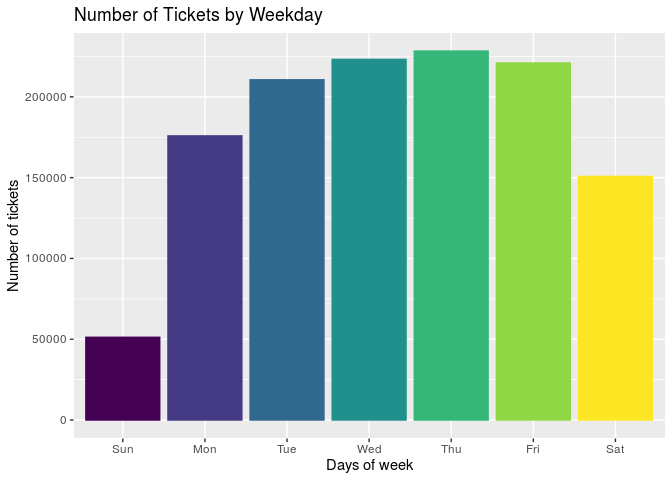

Philadelphia Parking Violations
================
Francis Lin | \#TidyTuesday |
2019-12-03

# Introduction

Welcome to my first
[\#TidyTuesday](https://github.com/rfordatascience/tidytuesday)\! This
week, I’ll be looking at a sample of parking violations in Philadelphia.
The full dataset is available at [Open Data
Philly](https://www.opendataphilly.org/dataset/parking-violations).

# R Program

## Set up

``` r
# source utilities
source("../utilities.R")

# packages
library(tidyverse)
library(lubridate)

# set data path
data_path <- set_data_path()
```

## Load Data

``` r
# read in data
tickets <- read.csv(paste(data_path, "tickets.csv", sep=""))
```

## Manipulate Data

I wanted to find the number of tickets issued by weekday. Using the pipe
operator, I was able to parse the date column to obtain the weekday. I
then grouped the data by weekday and counted the number of observations
per group. My hypothesis is that there would be more tickets issued
during weekdays than weekends.

``` r
# count number of tickets by weekday
count_by_weekday <-
    tickets %>%
    select(issue_datetime) %>%
    mutate(weekday = wday(issue_datetime, label=TRUE)) %>%
    count(weekday) %>%
    group_by(weekday)
```

## Plot

``` r
# plot number of tickets by weekday
count_by_weekday %>%
    ggplot() +
    aes(x = weekday, y = n, color = weekday, fill = weekday) +
    geom_bar(stat = "identity") + 
    labs(x = "Days of week", y = "Number of tickets") + 
    ggtitle("Number of Tickets by Weekday") +
    theme(legend.position = "none")
```

<!-- -->

It turns out my hypothesis was correct. However, I was surprised by how
much greater the number of tickets were issued on weekdays versus
weekends. Specifically, 3x fewer tickets were issued on Sunday than any
other day\!

## Save Plot

``` r
# save image
ggsave("plot/plot_2019-12-03.png", width = 29, height = 21, units = "cm", dpi = "retina")
```

## Session Info

``` r
#session info
sessionInfo()
```

    ## R version 3.5.3 (2019-03-11)
    ## Platform: x86_64-pc-linux-gnu (64-bit)
    ## Running under: Ubuntu 16.04.4 LTS
    ## 
    ## Matrix products: default
    ## BLAS/LAPACK: /opt/intel/compilers_and_libraries_2018.2.199/linux/mkl/lib/intel64_lin/libmkl_gf_lp64.so
    ## 
    ## locale:
    ##  [1] LC_CTYPE=en_US.UTF-8       LC_NUMERIC=C              
    ##  [3] LC_TIME=en_US.UTF-8        LC_COLLATE=en_US.UTF-8    
    ##  [5] LC_MONETARY=en_US.UTF-8    LC_MESSAGES=en_US.UTF-8   
    ##  [7] LC_PAPER=en_US.UTF-8       LC_NAME=C                 
    ##  [9] LC_ADDRESS=C               LC_TELEPHONE=C            
    ## [11] LC_MEASUREMENT=en_US.UTF-8 LC_IDENTIFICATION=C       
    ## 
    ## attached base packages:
    ## [1] stats     graphics  grDevices utils     datasets  methods   base     
    ## 
    ## other attached packages:
    ##  [1] lubridate_1.7.4 forcats_0.4.0   stringr_1.4.0   dplyr_0.8.3    
    ##  [5] purrr_0.3.2     readr_1.3.1     tidyr_0.8.3     tibble_2.1.3   
    ##  [9] ggplot2_3.2.0   tidyverse_1.2.1
    ## 
    ## loaded via a namespace (and not attached):
    ##  [1] Rcpp_1.0.1        cellranger_1.1.0  pillar_1.3.1     
    ##  [4] compiler_3.5.3    tools_3.5.3       zeallot_0.1.0    
    ##  [7] digest_0.6.18     packrat_0.5.0     viridisLite_0.3.0
    ## [10] jsonlite_1.6      evaluate_0.13     nlme_3.1-137     
    ## [13] gtable_0.3.0      lattice_0.20-38   pkgconfig_2.0.2  
    ## [16] rlang_0.4.0       cli_1.1.0         rstudioapi_0.10  
    ## [19] yaml_2.2.0        parallel_3.5.3    haven_2.1.1      
    ## [22] xfun_0.6          withr_2.1.2       xml2_1.2.0       
    ## [25] httr_1.4.0        knitr_1.22        vctrs_0.2.0      
    ## [28] hms_0.5.0         generics_0.0.2    grid_3.5.3       
    ## [31] tidyselect_0.2.5  glue_1.3.1        R6_2.4.0         
    ## [34] readxl_1.3.1      rmarkdown_1.13    modelr_0.1.4     
    ## [37] magrittr_1.5      backports_1.1.4   scales_1.0.0     
    ## [40] htmltools_0.3.6   rvest_0.3.3       assertthat_0.2.1 
    ## [43] colorspace_1.4-1  labeling_0.3      stringi_1.4.3    
    ## [46] lazyeval_0.2.2    munsell_0.5.0     broom_0.5.2      
    ## [49] crayon_1.3.4
