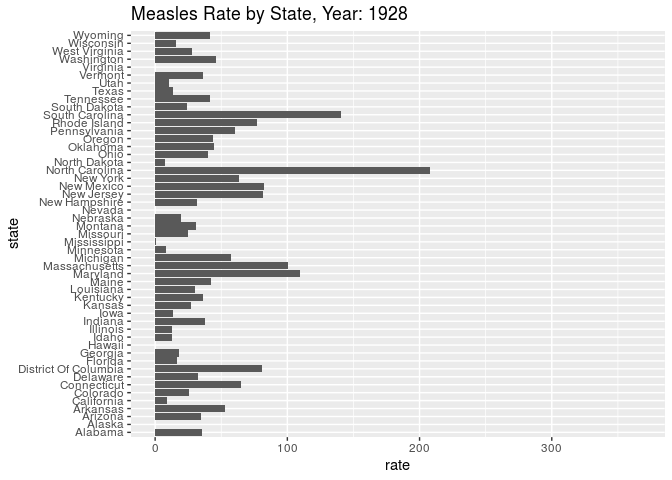

Infectious Diseases
================
Francis Lin | \#TidyTuesday |
2019-12-10

# Introduction

This dataset, originally from [Project
Tycho](https://www.tycho.pitt.edu/), contains the number of people
infected by a number of diseases in each state. Since I heard R could do
animations pretty well using gganimate, I wanted to animate how the rate
of infection changed for a certain disease over time.

# R Program

## Set up

``` r
# source utilities
source("../utilities.R")

# packages
library(tidyverse)
library(lubridate)
library(gganimate)

# set data path
data_path <- set_data_path()
```

## Load Data

``` r
# read in data
diseases <- read.csv(paste0(data_path, "diseases.csv"))
```

## Plot

``` r
# plot number of tickets by weekday

disease <- "Smallpox"

data <- diseases %>%
    filter(disease == disease) %>%
    mutate(rate = count / population * 10000 * 52 / weeks_reporting)

p <- ggplot(data) +
    aes(x = state, y = rate) +
    geom_bar(stat = "identity") +
    coord_flip() + 
    transition_time(year) +
    labs(title = "Measles Rate by State, Year: {frame_time}")

animation <- animate(p, fps=5, end_pause=10)
```

    ## Warning: Removed 3777 rows containing missing values (position_stack).

``` 
## 
Rendering [>---------------------------------------] at 11 fps ~ eta:  8s
Rendering [=>--------------------------------------] at 12 fps ~ eta:  7s
Rendering [==>-------------------------------------] at 12 fps ~ eta:  7s
Rendering [===>------------------------------------] at 12 fps ~ eta:  7s
Rendering [====>-----------------------------------] at 12 fps ~ eta:  7s
Rendering [=====>----------------------------------] at 12 fps ~ eta:  6s
Rendering [======>---------------------------------] at 12 fps ~ eta:  6s
Rendering [=======>--------------------------------] at 12 fps ~ eta:  6s
Rendering [========>-------------------------------] at 12 fps ~ eta:  6s
Rendering [=========>------------------------------] at 12 fps ~ eta:  6s
Rendering [==========>-----------------------------] at 12 fps ~ eta:  6s
Rendering [==========>-----------------------------] at 12 fps ~ eta:  5s
Rendering [===========>----------------------------] at 12 fps ~ eta:  5s
Rendering [============>---------------------------] at 12 fps ~ eta:  5s
Rendering [=============>--------------------------] at 12 fps ~ eta:  5s
Rendering [==============>-------------------------] at 12 fps ~ eta:  5s
Rendering [===============>------------------------] at 12 fps ~ eta:  5s
Rendering [===============>------------------------] at 12 fps ~ eta:  4s
Rendering [================>-----------------------] at 12 fps ~ eta:  4s
Rendering [=================>----------------------] at 12 fps ~ eta:  4s
Rendering [==================>---------------------] at 12 fps ~ eta:  4s
Rendering [===================>--------------------] at 12 fps ~ eta:  4s
Rendering [====================>-------------------] at 12 fps ~ eta:  4s
Rendering [=====================>------------------] at 12 fps ~ eta:  3s
Rendering [======================>-----------------] at 12 fps ~ eta:  3s
Rendering [=======================>----------------] at 12 fps ~ eta:  3s
Rendering [========================>---------------] at 12 fps ~ eta:  3s
Rendering [=========================>--------------] at 12 fps ~ eta:  3s
Rendering [==========================>-------------] at 12 fps ~ eta:  3s
Rendering [==========================>-------------] at 12 fps ~ eta:  2s
Rendering [===========================>------------] at 12 fps ~ eta:  2s
Rendering [============================>-----------] at 12 fps ~ eta:  2s
Rendering [=============================>----------] at 12 fps ~ eta:  2s
Rendering [==============================>---------] at 12 fps ~ eta:  2s
Rendering [===============================>--------] at 12 fps ~ eta:  2s
Rendering [===============================>--------] at 12 fps ~ eta:  1s
Rendering [================================>-------] at 12 fps ~ eta:  1s
Rendering [=================================>------] at 12 fps ~ eta:  1s
Rendering [==================================>-----] at 12 fps ~ eta:  1s
Rendering [===================================>----] at 12 fps ~ eta:  1s
Rendering [====================================>---] at 12 fps ~ eta:  1s
Rendering [=====================================>--] at 12 fps ~ eta:  0s
Rendering [======================================>-] at 12 fps ~ eta:  0s
Rendering [=======================================>] at 12 fps ~ eta:  0s
Rendering [========================================] at 12 fps ~ eta:  0s
                                                                         
```

    ## 
    Frame 1 (1%)
    Frame 2 (2%)
    Frame 3 (3%)
    Frame 4 (4%)
    Frame 5 (5%)
    Frame 6 (6%)
    Frame 7 (7%)
    Frame 8 (8%)
    Frame 9 (9%)
    Frame 10 (10%)
    Frame 11 (11%)
    Frame 12 (12%)
    Frame 13 (13%)
    Frame 14 (14%)
    Frame 15 (15%)
    Frame 16 (16%)
    Frame 17 (17%)
    Frame 18 (18%)
    Frame 19 (19%)
    Frame 20 (20%)
    Frame 21 (21%)
    Frame 22 (22%)
    Frame 23 (23%)
    Frame 24 (24%)
    Frame 25 (25%)
    Frame 26 (26%)
    Frame 27 (27%)
    Frame 28 (28%)
    Frame 29 (29%)
    Frame 30 (30%)
    Frame 31 (31%)
    Frame 32 (32%)
    Frame 33 (33%)
    Frame 34 (34%)
    Frame 35 (35%)
    Frame 36 (36%)
    Frame 37 (37%)
    Frame 38 (38%)
    Frame 39 (39%)
    Frame 40 (40%)
    Frame 41 (41%)
    Frame 42 (42%)
    Frame 43 (43%)
    Frame 44 (44%)
    Frame 45 (45%)
    Frame 46 (46%)
    Frame 47 (47%)
    Frame 48 (48%)
    Frame 49 (49%)
    Frame 50 (50%)
    Frame 51 (51%)
    Frame 52 (52%)
    Frame 53 (53%)
    Frame 54 (54%)
    Frame 55 (55%)
    Frame 56 (56%)
    Frame 57 (57%)
    Frame 58 (58%)
    Frame 59 (59%)
    Frame 60 (60%)
    Frame 61 (61%)
    Frame 62 (62%)
    Frame 63 (63%)
    Frame 64 (64%)
    Frame 65 (65%)
    Frame 66 (66%)
    Frame 67 (67%)
    Frame 68 (68%)
    Frame 69 (69%)
    Frame 70 (70%)
    Frame 71 (71%)
    Frame 72 (72%)
    Frame 73 (73%)
    Frame 74 (74%)
    Frame 75 (75%)
    Frame 76 (76%)
    Frame 77 (77%)
    Frame 78 (78%)
    Frame 79 (79%)
    Frame 80 (80%)
    Frame 81 (81%)
    Frame 82 (82%)
    Frame 83 (83%)
    Frame 84 (84%)
    Frame 85 (85%)
    Frame 86 (86%)
    Frame 87 (87%)
    Frame 88 (88%)
    Frame 89 (89%)
    Frame 90 (90%)
    Frame 91 (91%)
    Frame 92 (92%)
    Frame 93 (93%)
    Frame 94 (94%)
    Frame 95 (95%)
    Frame 96 (96%)
    Frame 97 (97%)
    Frame 98 (98%)
    Frame 99 (99%)
    Frame 100 (100%)
    ## Finalizing encoding... done!

``` r
animation
```

<!-- -->

## Save Plot

``` r
anim_save("plot/plot_2019-12-10.gif", animation)
```

## Session Info

``` r
#session info
sessionInfo()
```

    ## R version 3.5.3 (2019-03-11)
    ## Platform: x86_64-pc-linux-gnu (64-bit)
    ## Running under: Ubuntu 16.04.4 LTS
    ## 
    ## Matrix products: default
    ## BLAS/LAPACK: /opt/intel/compilers_and_libraries_2018.2.199/linux/mkl/lib/intel64_lin/libmkl_gf_lp64.so
    ## 
    ## locale:
    ##  [1] LC_CTYPE=en_US.UTF-8       LC_NUMERIC=C              
    ##  [3] LC_TIME=en_US.UTF-8        LC_COLLATE=en_US.UTF-8    
    ##  [5] LC_MONETARY=en_US.UTF-8    LC_MESSAGES=en_US.UTF-8   
    ##  [7] LC_PAPER=en_US.UTF-8       LC_NAME=C                 
    ##  [9] LC_ADDRESS=C               LC_TELEPHONE=C            
    ## [11] LC_MEASUREMENT=en_US.UTF-8 LC_IDENTIFICATION=C       
    ## 
    ## attached base packages:
    ## [1] stats     graphics  grDevices utils     datasets  methods   base     
    ## 
    ## other attached packages:
    ##  [1] gganimate_1.0.3 lubridate_1.7.4 forcats_0.4.0   stringr_1.4.0  
    ##  [5] dplyr_0.8.3     purrr_0.3.2     readr_1.3.1     tidyr_0.8.3    
    ##  [9] tibble_2.1.3    ggplot2_3.2.0   tidyverse_1.2.1
    ## 
    ## loaded via a namespace (and not attached):
    ##  [1] progress_1.2.2    tidyselect_0.2.5  xfun_0.6         
    ##  [4] haven_2.1.1       lattice_0.20-38   colorspace_1.4-1 
    ##  [7] generics_0.0.2    vctrs_0.2.0       htmltools_0.3.6  
    ## [10] yaml_2.2.0        rlang_0.4.0       pillar_1.3.1     
    ## [13] glue_1.3.1        withr_2.1.2       tweenr_1.0.1     
    ## [16] modelr_0.1.4      readxl_1.3.1      plyr_1.8.4       
    ## [19] munsell_0.5.0     gtable_0.3.0      cellranger_1.1.0 
    ## [22] rvest_0.3.3       evaluate_0.13     labeling_0.3     
    ## [25] knitr_1.22        parallel_3.5.3    gifski_0.8.6     
    ## [28] broom_0.5.2       Rcpp_1.0.1        scales_1.0.0     
    ## [31] backports_1.1.4   jsonlite_1.6      farver_1.1.0     
    ## [34] png_0.1-7         hms_0.5.0         packrat_0.5.0    
    ## [37] digest_0.6.18     stringi_1.4.3     grid_3.5.3       
    ## [40] cli_1.1.0         tools_3.5.3       magrittr_1.5     
    ## [43] lazyeval_0.2.2    crayon_1.3.4      pkgconfig_2.0.2  
    ## [46] zeallot_0.1.0     xml2_1.2.0        prettyunits_1.0.2
    ## [49] assertthat_0.2.1  rmarkdown_1.13    httr_1.4.0       
    ## [52] rstudioapi_0.10   R6_2.4.0          nlme_3.1-137     
    ## [55] compiler_3.5.3
