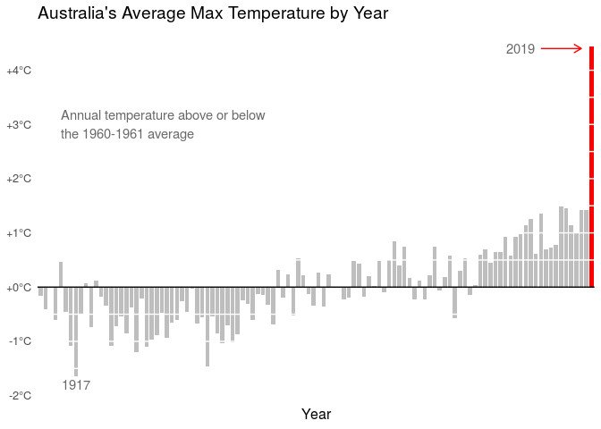

\#TidyTuesday 2020-01-10
================
Francis Lin

Set up

``` r
# source utilities
source("../utilities.R")

# packages
library(tidyverse)
library(readr)

# set data path
data_path <- set_data_path()
```

Load Data

``` r
# read in data
temperature <- read_csv(paste0(data_path, "temperature.csv"), col_types=cols(date = col_date(format="%Y-%m-%d")))
```

Manipulate Data

``` r
# find average temperature for each day
max_temp_date <- temperature %>%
    filter(temp_type == "max") %>%
    group_by(date) %>% 
    summarise(daily_temp = mean(temperature, na.rm=TRUE))

# find average temperature for each year
max_temp_annual <- max_temp_date %>%
    mutate(year=format(date, "%Y")) %>%
    group_by(year) %>%
    summarise(annual_temp = mean(daily_temp, na.rm=TRUE))

# find difference of each year from average
max_temp_annual$annual_temp_diff <- max_temp_annual$annual_temp - mean(max_temp_annual[which(max_temp_annual$year %in% c(1960, 1961)),]$annual_temp)
```

Plot

``` r
# plot
p <- ggplot(data=max_temp_annual, aes(x=year, y=annual_temp_diff, fill=factor(ifelse(year==2019,"Highlighted","Normal")))) +
    
    # bar graph
    geom_bar(stat="identity", width=0.8) +
    
    # axes and colors
    scale_fill_manual(name = "date", values=c("red","grey"))+
    theme(text = element_text(size=12), panel.background = element_blank(), panel.grid.major = element_blank(), axis.title.y=element_blank(), axis.text.x=element_blank(), axis.ticks.x=element_blank(), axis.ticks.y=element_blank(), legend.position="none") +
    xlab("Year") + 
    scale_y_continuous(breaks=seq(floor(min(max_temp_annual$annual_temp_diff)), ceiling(max(max_temp_annual$annual_temp_diff)), by=1), labels=function(x) {ifelse(x>=0, paste0("+", x, "°C"), paste0(x, "°C"))}) + 
    ggtitle("Australia's Average Max Temperature by Year") +
    
    # annotation arrow
    annotate("segment", x = 100, xend = 108, y = 4.4, yend = 4.4, colour = "red", size=0.5, alpha=1, arrow=arrow(length = unit(0.1, "inches"))) + 
    
    # annotation text
    annotate("text", x = 5, y = 3, hjust=0, label = "Annual temperature above or below\nthe 1960-1961 average", color="dimgrey") + 
    annotate("text", x=96, y=4.4, label="2019", color="dimgrey") + 
    annotate("text", x=8, y=-1.8, label="1917", color="dimgrey") + 
    
    # horizontal lines
    geom_hline(yintercept=c(-1.5, -1, -0.5, 0.5, 1, 1.5, 2, 2.5, 3, 3.5, 4), color="white", size=0.5) + 
    geom_hline(yintercept=0, color="black", size=0.5)

p
```

<!-- -->

Save Image

``` r
# save image
ggsave("plot/plot_2020-01-07.png", width = 29, height = 21, units = "cm", dpi = "retina")
```

Session Info

``` r
#session info
sessionInfo()
```

    ## R version 3.5.3 (2019-03-11)
    ## Platform: x86_64-pc-linux-gnu (64-bit)
    ## Running under: Ubuntu 16.04.4 LTS
    ## 
    ## Matrix products: default
    ## BLAS/LAPACK: /opt/intel/compilers_and_libraries_2018.2.199/linux/mkl/lib/intel64_lin/libmkl_gf_lp64.so
    ## 
    ## locale:
    ##  [1] LC_CTYPE=en_US.UTF-8       LC_NUMERIC=C              
    ##  [3] LC_TIME=en_US.UTF-8        LC_COLLATE=en_US.UTF-8    
    ##  [5] LC_MONETARY=en_US.UTF-8    LC_MESSAGES=en_US.UTF-8   
    ##  [7] LC_PAPER=en_US.UTF-8       LC_NAME=C                 
    ##  [9] LC_ADDRESS=C               LC_TELEPHONE=C            
    ## [11] LC_MEASUREMENT=en_US.UTF-8 LC_IDENTIFICATION=C       
    ## 
    ## attached base packages:
    ## [1] stats     graphics  grDevices utils     datasets  methods   base     
    ## 
    ## other attached packages:
    ## [1] forcats_0.4.0   stringr_1.4.0   dplyr_0.8.3     purrr_0.3.2    
    ## [5] readr_1.3.1     tidyr_0.8.3     tibble_2.1.3    ggplot2_3.2.0  
    ## [9] tidyverse_1.2.1
    ## 
    ## loaded via a namespace (and not attached):
    ##  [1] Rcpp_1.0.1       cellranger_1.1.0 pillar_1.3.1     compiler_3.5.3  
    ##  [5] tools_3.5.3      digest_0.6.18    zeallot_0.1.0    packrat_0.5.0   
    ##  [9] evaluate_0.13    lubridate_1.7.4  jsonlite_1.6     nlme_3.1-137    
    ## [13] gtable_0.3.0     lattice_0.20-38  pkgconfig_2.0.2  rlang_0.4.0     
    ## [17] cli_1.1.0        rstudioapi_0.10  yaml_2.2.0       parallel_3.5.3  
    ## [21] haven_2.1.1      xfun_0.6         withr_2.1.2      xml2_1.2.0      
    ## [25] httr_1.4.0       knitr_1.22       generics_0.0.2   vctrs_0.2.0     
    ## [29] hms_0.5.0        grid_3.5.3       tidyselect_0.2.5 glue_1.3.1      
    ## [33] R6_2.4.0         readxl_1.3.1     rmarkdown_1.13   modelr_0.1.4    
    ## [37] magrittr_1.5     htmltools_0.3.6  backports_1.1.4  scales_1.0.0    
    ## [41] rvest_0.3.3      assertthat_0.2.1 colorspace_1.4-1 stringi_1.4.3   
    ## [45] lazyeval_0.2.2   munsell_0.5.0    broom_0.5.2      crayon_1.3.4
