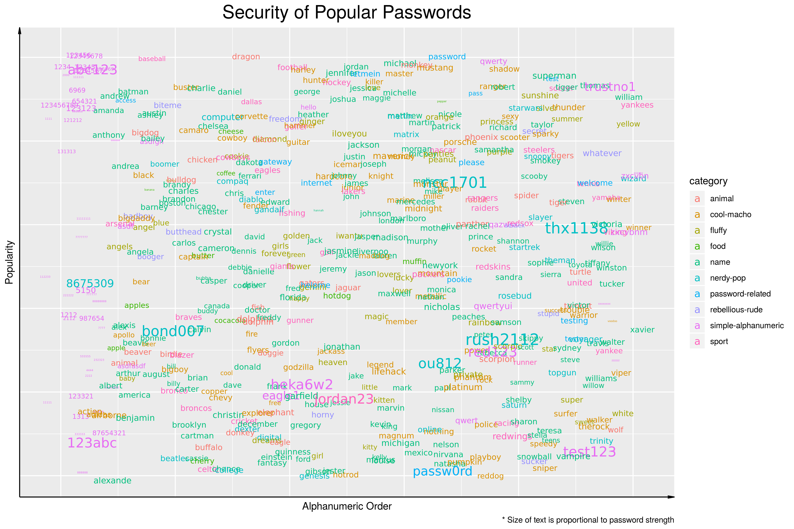

Passwords
================
Francis Lin | \#TidyTuesday |
2020-01-14

# Introduction

The top 500 common passwords and their relative strengths were provided
by [Information is
Beautiful](https://docs.google.com/spreadsheets/d/1cz7TDhm0ebVpySqbTvrHrD3WpxeyE4hLZtifWSnoNTQ/edit#gid=21).
Besides the usual bad “password” and “123456” passwords, other
interesting passwords have made their way into the top 500.

  - \#149: “ncc1701” - the ship number for the Starship Enterprise
  - \#187: “thx1138” - the name of George Lucas’s first movie
  - \#336: “rush2112” - fourth studio album by Canadian rock band Rush

If you find your password in the list, make sure to change it, fast\!

# R Program

## Set up

``` r
# source utilities
source("../utilities.R")

# packages
library(tidyverse)
library(readr)

# set data path
data_path <- set_data_path()

# create plot folder
ifelse(!dir.exists("./plot"), dir.create("./plot"), FALSE)
```

    ## [1] FALSE

## Load Data

``` r
# read in data
passwords <- read_csv(paste0(data_path, "passwords.csv"), n_max=500)

# arrange by password
passwords <- passwords%>%arrange(password)
```

## Plot data

``` r
# plot 
# order x alphanumerically, y by popularity
# color by category
# size by strength
p <- ggplot(passwords, aes(as.numeric(row.names(passwords)), desc(rank), label=password, color=category)) +
    geom_text(aes(size=(font_size+1)^2), position=position_jitter(width=20,height=10), family="NimbusRom") + 
    
    # no ticks, axes arrow, title font size
    guides(size=FALSE) +
    theme(axis.ticks=element_blank(), axis.text=element_blank(), axis.line = element_line(arrow=arrow(angle=10, length=unit(0.1, "inches"), type = "open")), plot.title=element_text(size=20, hjust = 0.5)) + 
    
    # labels
    labs(title="Security of Popular Passwords",
         x="Alphanumeric Order",
         y="Popularity",
         caption="* Size of text is proportional to password strength") +
    
    # size
    coord_cartesian(xlim=c(-10, 510), ylim=c(-500, 10), clip="off")
```

## Save Image

``` r
ggsave("plot/plot_2020-01-14.png", p, width=12, height=8, units ="in")
```



## Session Info

``` r
#session info
sessionInfo()
```

    ## R version 3.6.1 (2019-07-05)
    ## Platform: x86_64-pc-linux-gnu (64-bit)
    ## Running under: Ubuntu 16.04.4 LTS
    ## 
    ## Matrix products: default
    ## BLAS/LAPACK: /opt/intel/compilers_and_libraries_2018.2.199/linux/mkl/lib/intel64_lin/libmkl_gf_lp64.so
    ## 
    ## locale:
    ##  [1] LC_CTYPE=en_US.UTF-8       LC_NUMERIC=C               LC_TIME=en_US.UTF-8       
    ##  [4] LC_COLLATE=en_US.UTF-8     LC_MONETARY=en_US.UTF-8    LC_MESSAGES=en_US.UTF-8   
    ##  [7] LC_PAPER=en_US.UTF-8       LC_NAME=C                  LC_ADDRESS=C              
    ## [10] LC_TELEPHONE=C             LC_MEASUREMENT=en_US.UTF-8 LC_IDENTIFICATION=C       
    ## 
    ## attached base packages:
    ## [1] stats     graphics  grDevices utils     datasets  methods   base     
    ## 
    ## other attached packages:
    ## [1] forcats_0.4.0   stringr_1.4.0   dplyr_0.8.3     purrr_0.3.3     readr_1.3.1     tidyr_1.0.0    
    ## [7] tibble_2.1.3    ggplot2_3.2.1   tidyverse_1.3.0
    ## 
    ## loaded via a namespace (and not attached):
    ##  [1] Rcpp_1.0.3         lubridate_1.7.4    lattice_0.20-38    prettyunits_1.0.2  ps_1.3.0          
    ##  [6] assertthat_0.2.1   zeallot_0.1.0      packrat_0.5.0      digest_0.6.23      R6_2.4.1          
    ## [11] cellranger_1.1.0   backports_1.1.5    reprex_0.3.0       stats4_3.6.1       evaluate_0.14     
    ## [16] httr_1.4.1         pillar_1.4.3       rlang_0.4.2        lazyeval_0.2.2     readxl_1.3.1      
    ## [21] rstudioapi_0.10    callr_3.4.0        rmarkdown_2.0      labeling_0.3       loo_2.2.0         
    ## [26] munsell_0.5.0      broom_0.5.3        compiler_3.6.1     modelr_0.1.5       xfun_0.11         
    ## [31] rstan_2.19.2       pkgconfig_2.0.3    pkgbuild_1.0.6     htmltools_0.4.0    tidyselect_0.2.5  
    ## [36] gridExtra_2.3      matrixStats_0.55.0 fansi_0.4.0        crayon_1.3.4       dbplyr_1.4.2      
    ## [41] withr_2.1.2        grid_3.6.1         nlme_3.1-143       jsonlite_1.6       gtable_0.3.0      
    ## [46] lifecycle_0.1.0    DBI_1.1.0          magrittr_1.5       StanHeaders_2.19.0 scales_1.1.0      
    ## [51] cli_2.0.0          stringi_1.4.3      farver_2.0.1       fs_1.3.1           xml2_1.2.2        
    ## [56] generics_0.0.2     vctrs_0.2.1        tools_3.6.1        glue_1.3.1         hms_0.5.2         
    ## [61] yaml_2.2.0         processx_3.4.1     parallel_3.6.1     inline_0.3.15      colorspace_1.4-1  
    ## [66] rvest_0.3.5        knitr_1.26         haven_2.2.0
