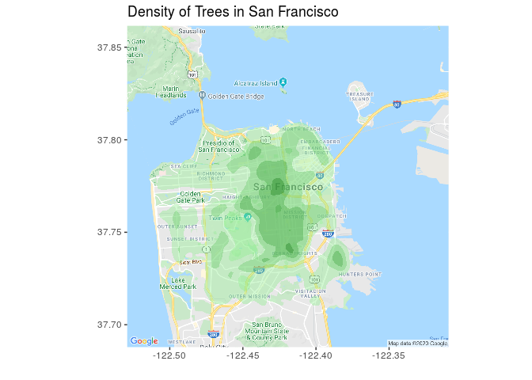

San Francisco Trees
================
Francis Lin | \#TidyTuesday |
2020-01-28

# Introduction

This week’s \#TidyTuesday is about trees in San Francisco\! While there
was a lot of information provided here, I wanted to take my very first
crack at plotting geospatial data. The dataset actually reminded me of a
[Hack for LA Public Tree Map
project](https://public-tree-map.surge.sh/). Perhaps it would be a good
exercise someday to see if I can replicate a similar app using something
like Shiny.

Coincidentally, I was also in rstudio::conf at San Francisco this
weekend and met [Thomas Mock](https://thomasmock.netlify.com/), the
creator of TidyTuesdays\! I didn’t, however, have time to really
appreciate the trees there..

# R Program

## Set up

``` r
# source utilities
source("../utilities.R")

# packages
library(tidyverse)
library(lubridate)
library(ggmap)
library(grDevices)

# set data path
data_path <- set_data_path()

# create plot folder if doesn't exist
if (!dir.exists("./plot")) {dir.create("./plot")}
```

## Load Data

``` r
# read in data
sf_trees <- read_csv(paste0(data_path, "Street_Tree_Map.csv"),
    col_types = 
        cols(
            TreeID = col_double(),
            qLegalStatus = col_character(),
            qSpecies = col_character(),
            qAddress = col_character(),
            SiteOrder = col_double(),
            qSiteInfo = col_character(),
            PlantType = col_character(),
            qCaretaker = col_character(),
            qCareAssistant = col_character(),
            PlantDate = col_character(),
            DBH = col_double(),
            PlotSize = col_character(),
            PermitNotes = col_character(),
            XCoord = col_double(),
            YCoord = col_double(),
            Latitude = col_double(),
            Longitude = col_double(),
            Location = col_character()))
```

## Create Map

``` r
# read in google maps API key
register_google(key=read_key("google"))

# create ggmap
sf_map <- get_map(location = c(-122.4194, 37.7749), maptype = "roadmap", zoom=12)
tree_map <- ggmap(sf_map)
```

## Manipulate Data

``` r
# filter out trees without long/lat or out of range
sf_trees_filtered <- sf_trees %>% 
    drop_na(Longitude, Latitude) %>%
    filter(between(Longitude, min(tree_map$data$lon), max(tree_map$data$lon)), between(Latitude, min(tree_map$data$lat), max(tree_map$data$lat))) %>%
    select(Longitude, Latitude)
```

## Plot Density

``` r
# plot density as contour map
p <- tree_map + 
    stat_density2d(data=sf_trees_filtered, aes(x=Longitude, y=Latitude, fill=..level..), bins=5, alpha=0.4, geom="polygon") +
    scale_fill_gradientn(colours=colorRampPalette(c("lightgreen", "darkgreen"))(255)) + 
    theme(legend.position="none") + 
    labs(x="", y="", title="Density of Trees in San Francisco")
p
```

<!-- -->

From this plot, the areas around Filmore District have the highest tree
density. The tree density decreases as you move away from the center of
the city. I was surprised to see absolutely no trees in the Golden Gate
Park area, which is full of trees in real life. Perhaps there were too
many trees in the Golden Gate Park and they decided to exclude it. Also,
the dataset had dropped a few rows where \> 75% of the columns were
missing or redundant, which could have filtered out the Golden Gate Park
trees.

I heard that the `sf` package is also quite good for geospatial data so
I should try that next time.

## Save Image

``` r
ggsave("plot/plot_2020-01-28.png", p, width=12, height=12, units="in")
```

## Session Info

``` r
sessionInfo()
```

    ## R version 3.6.1 (2019-07-05)
    ## Platform: x86_64-pc-linux-gnu (64-bit)
    ## Running under: Ubuntu 16.04.4 LTS
    ## 
    ## Matrix products: default
    ## BLAS/LAPACK: /opt/intel/compilers_and_libraries_2018.2.199/linux/mkl/lib/intel64_lin/libmkl_gf_lp64.so
    ## 
    ## locale:
    ##  [1] LC_CTYPE=en_US.UTF-8       LC_NUMERIC=C               LC_TIME=en_US.UTF-8       
    ##  [4] LC_COLLATE=en_US.UTF-8     LC_MONETARY=en_US.UTF-8    LC_MESSAGES=en_US.UTF-8   
    ##  [7] LC_PAPER=en_US.UTF-8       LC_NAME=C                  LC_ADDRESS=C              
    ## [10] LC_TELEPHONE=C             LC_MEASUREMENT=en_US.UTF-8 LC_IDENTIFICATION=C       
    ## 
    ## attached base packages:
    ## [1] stats     graphics  grDevices utils     datasets  methods   base     
    ## 
    ## other attached packages:
    ##  [1] ggmap_3.0.0     lubridate_1.7.4 forcats_0.4.0   stringr_1.4.0   dplyr_0.8.3    
    ##  [6] purrr_0.3.3     readr_1.3.1     tidyr_1.0.0     tibble_2.1.3    ggplot2_3.2.1  
    ## [11] tidyverse_1.3.0
    ## 
    ## loaded via a namespace (and not attached):
    ##  [1] httr_1.4.1          jsonlite_1.6        modelr_0.1.5        StanHeaders_2.19.0 
    ##  [5] assertthat_0.2.1    stats4_3.6.1        cellranger_1.1.0    yaml_2.2.0         
    ##  [9] pillar_1.4.3        backports_1.1.5     lattice_0.20-38     glue_1.3.1         
    ## [13] digest_0.6.23       rvest_0.3.5         colorspace_1.4-1    htmltools_0.4.0    
    ## [17] plyr_1.8.5          pkgconfig_2.0.3     rstan_2.19.2        broom_0.5.3        
    ## [21] haven_2.2.0         scales_1.1.0        processx_3.4.1      jpeg_0.1-8.1       
    ## [25] generics_0.0.2      farver_2.0.1        ellipsis_0.3.0      withr_2.1.2        
    ## [29] lazyeval_0.2.2      cli_2.0.1           magrittr_1.5        crayon_1.3.4       
    ## [33] readxl_1.3.1        evaluate_0.14       ps_1.3.0            fs_1.3.1           
    ## [37] fansi_0.4.1         MASS_7.3-51.5       nlme_3.1-143        xml2_1.2.2         
    ## [41] pkgbuild_1.0.6      tools_3.6.1         loo_2.2.0           prettyunits_1.1.0  
    ## [45] hms_0.5.3           RgoogleMaps_1.4.5.2 lifecycle_0.1.0     matrixStats_0.55.0 
    ## [49] munsell_0.5.0       reprex_0.3.0        callr_3.4.0         packrat_0.5.0      
    ## [53] compiler_3.6.1      rlang_0.4.2         grid_3.6.1          rstudioapi_0.10    
    ## [57] rjson_0.2.20        labeling_0.3        bitops_1.0-6        rmarkdown_2.0      
    ## [61] gtable_0.3.0        inline_0.3.15       DBI_1.1.0           curl_4.3           
    ## [65] R6_2.4.1            gridExtra_2.3       knitr_1.26          zeallot_0.1.0      
    ## [69] stringi_1.4.5       parallel_3.6.1      Rcpp_1.0.3          vctrs_0.2.1        
    ## [73] png_0.1-7           dbplyr_1.4.2        tidyselect_0.2.5    xfun_0.12
