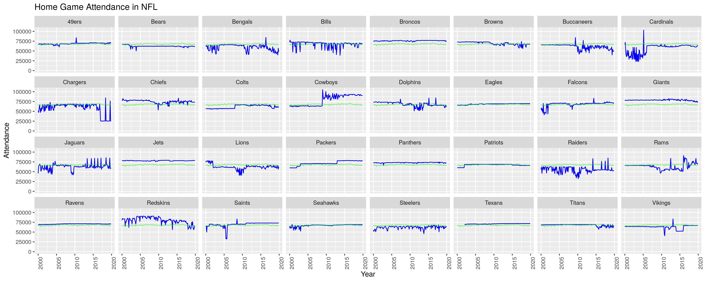

NFL Stadium Attendance
================
Francis Lin | \#TidyTuesday |
2020-02-04

# Introduction

This week’s data comes from [Pro Football
Reference](https://www.pro-football-reference.com/years/2019/index.htm).
I’ll be honest, I know next to nothing about American football. I’m much
more familiar with basketball. Nevertheless, I took a stab at seeing how
home game attendance fluctuated throughout the history of each team in
the NFL.

# R Program

## Set up

``` r
# source utilities
source("../utilities.R")

# packages
library(tidyverse)
library(readr)
library(scales)

# set data path
data_path <- set_data_path()

# create plot folder if doesn't exist
if (!dir.exists("./plot")) {dir.create("./plot")}
```

## Load Data

``` r
attendance <- read_csv(paste0(data_path, "attendance.csv"))
standings <- read_csv(paste0(data_path, "standings.csv"))
games <- read_csv(paste0(data_path, "games.csv"))
```

## Manipulate Data

``` r
# clean up games
games <- games %>%
    select(year, week, home_team_name, home_team_city, away_team_name, away_team_city) %>%
    filter(!is.na(as.numeric(week))) %>%
    mutate(week = as.numeric(week))
```

    ## Warning: NAs introduced by coercion

``` r
# merge attendance and games to label home games
merged <- attendance %>% 
    drop_na(weekly_attendance) %>%
    left_join(games, by=(c("year", "week", "team_name"="home_team_name"))) %>%
    select(-home, -away, -total) %>%
    mutate(home = !is.na(home_team_city)) %>%
    select(-starts_with("home_"), -starts_with("away_"))

# filter and sort home game attendance
home_data <- merged %>%
    filter(home==TRUE) %>% 
    arrange(team_name, year, week) %>%
    group_by(team_name) %>%
    mutate(game_number=min(year) + (row_number()-1)/8)

# find average home game attendance throughout league
league_avg <- home_data %>%
    group_by(game_number) %>%
    summarise(avg=mean(weekly_attendance))
```

## Plot data

``` r
p <- ggplot(data=home_data) + 
    geom_line(aes(x=game_number, y=weekly_attendance), size=0.5, color="blue") +
    facet_wrap(~team_name, ncol = 8) + 
    geom_line(data=league_avg, aes(x=game_number, y=avg), size=0.5, color="green", alpha=0.5) +
    ylim(0, NA) +
    theme(axis.text.x = element_text(angle = 90, hjust = 1)) + 
    labs(x="Year", y="Attendance", title="Home Game Attendance in NFL")
```

 League home
game attendance average is shown in green.

## Save Image

``` r
ggsave("plot/plot_2020-02-04.png", p, width=15, height=6, units="in")
```

## Session Info

``` r
sessionInfo()
```

    ## R version 3.6.1 (2019-07-05)
    ## Platform: x86_64-pc-linux-gnu (64-bit)
    ## Running under: Ubuntu 18.04.3 LTS
    ## 
    ## Matrix products: default
    ## BLAS/LAPACK: /opt/intel/compilers_and_libraries_2018.2.199/linux/mkl/lib/intel64_lin/libmkl_gf_lp64.so
    ## 
    ## locale:
    ##  [1] LC_CTYPE=en_US.UTF-8       LC_NUMERIC=C              
    ##  [3] LC_TIME=en_US.UTF-8        LC_COLLATE=en_US.UTF-8    
    ##  [5] LC_MONETARY=en_US.UTF-8    LC_MESSAGES=en_US.UTF-8   
    ##  [7] LC_PAPER=en_US.UTF-8       LC_NAME=C                 
    ##  [9] LC_ADDRESS=C               LC_TELEPHONE=C            
    ## [11] LC_MEASUREMENT=en_US.UTF-8 LC_IDENTIFICATION=C       
    ## 
    ## attached base packages:
    ## [1] stats     graphics  grDevices utils     datasets  methods   base     
    ## 
    ## other attached packages:
    ##  [1] scales_1.1.0    forcats_0.4.0   stringr_1.4.0   dplyr_0.8.4    
    ##  [5] purrr_0.3.3     readr_1.3.1     tidyr_1.0.2     tibble_2.1.3   
    ##  [9] ggplot2_3.2.1   tidyverse_1.3.0
    ## 
    ## loaded via a namespace (and not attached):
    ##  [1] tidyselect_1.0.0 xfun_0.12        haven_2.2.0      lattice_0.20-38 
    ##  [5] colorspace_1.4-1 vctrs_0.2.2      generics_0.0.2   htmltools_0.4.0 
    ##  [9] yaml_2.2.1       rlang_0.4.4      pillar_1.4.3     glue_1.3.1      
    ## [13] withr_2.1.2      DBI_1.1.0        dbplyr_1.4.2     modelr_0.1.5    
    ## [17] readxl_1.3.1     lifecycle_0.1.0  munsell_0.5.0    gtable_0.3.0    
    ## [21] cellranger_1.1.0 rvest_0.3.5      evaluate_0.14    labeling_0.3    
    ## [25] knitr_1.27       parallel_3.6.1   fansi_0.4.1      broom_0.5.4     
    ## [29] Rcpp_1.0.3       backports_1.1.5  jsonlite_1.6.1   farver_2.0.3    
    ## [33] fs_1.3.1         digest_0.6.23    hms_0.5.3        packrat_0.5.0   
    ## [37] stringi_1.4.5    grid_3.6.1       cli_2.0.1        tools_3.6.1     
    ## [41] magrittr_1.5     lazyeval_0.2.2   crayon_1.3.4     pkgconfig_2.0.3 
    ## [45] ellipsis_0.3.0   xml2_1.2.2       reprex_0.3.0     lubridate_1.7.4 
    ## [49] assertthat_0.2.1 rmarkdown_2.1    httr_1.4.1       rstudioapi_0.10 
    ## [53] R6_2.4.1         nlme_3.1-143     compiler_3.6.1
