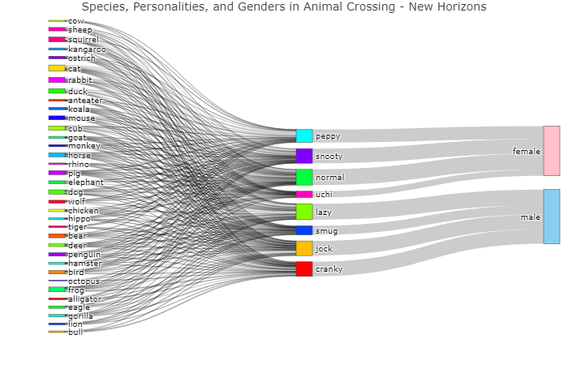

Animal Crossing - New Horizons
================
Francis Lin | \#TidyTuesday |
2020-05-05

# Introduction

During the quarantine, Animal Crossing’s popularity has skyrocketed -
roughly [11 million
people](https://www.theguardian.com/games/2020/may/13/animal-crossing-new-horizons-nintendo-game-coronavirus)
are playing this life simulation game. Using data from
[VillagerDB](https://github.com/jefflomacy/villagerdb), I created a
Sankey diagram to show the flow of characters in regards to their
species, personality, and gender. I’ve always wanted to create Sankey
diagrams, but I didn’t know it was so easy to do in R\!

# R Program

## Set up

``` r
# source utilities
source("../utilities.R")

# packages
library(tidyverse)
library(plotly)

# set data path
data_path <- set_data_path()

# create plot folder if doesn't exist
if (!dir.exists("./plot")) {dir.create("./plot")}
```

## Load Data

``` r
villagers_data <- read_csv(paste0(data_path, "villagers.csv"))
```

## Manipulate data

Here, we manipulate the given data to make it easier to create a Sankey
diagram. We need to create the labels and colors for nodes, as well as
indicate the source, target, and value for each link between nodes.

``` r
# variables to analyze
villagers <- villagers_data %>% 
    select(species, personality, gender)

# list of labels for Sankey diagram for each node
villagers_label <- c(sort(unique(villagers$species)), sort(unique(villagers$personality)), sort(unique(villagers$gender)))

# list of colors for Sankey diagram for each node
villagers_color <- c(rainbow(length(unique(villagers$species))), rainbow(length(unique(villagers$personality))), "#FFC0CB", "#89cff0")

# linkage for species-personality
villagers_species_personality_link <- villagers %>%
    group_by(species, personality) %>%
    summarise(value=n()) %>%
    mutate(source=match(species, villagers_label), target=match(personality, villagers_label))

# linkage for personality-gender
villagers_personality_gender_link <- villagers %>%
    group_by(personality, gender) %>%
    summarise(value=n()) %>%
    mutate(source=match(personality, villagers_label), target=match(gender, villagers_label))

# concatenate linkages
villagers_link <- rbind(villagers_species_personality_link, villagers_personality_gender_link)
```

## Plot Data

``` r
p <- plot_ly(
    type = "sankey",
    orientation = "h",

    node = list(
        label = villagers_label, 
        color = villagers_color
    ),

    link = list(
        source = villagers_link$source-1,
        target = villagers_link$target-1,
        value =  villagers_link$value
    )) %>% 
  layout(
    title = "Species, Personalities, and Genders in Animal Crossing - New Horizons",
    font = list(size = 10)
    )

#p
```

I was able to see the interactive Sankey diagram within RStudio, but
rendering it to either a .md or .html file caused me problems, so I have
just saved it to a .png and displayed it below. If anybody knows how to
solve this solution, please reach out\!



Interestingly, the personality types are unique to gender in ACNH\!

## Session Info

``` r
sessionInfo()
```

    ## R version 3.6.1 (2019-07-05)
    ## Platform: x86_64-pc-linux-gnu (64-bit)
    ## Running under: Ubuntu 18.04.3 LTS
    ## 
    ## Matrix products: default
    ## BLAS/LAPACK: /opt/intel/compilers_and_libraries_2018.2.199/linux/mkl/lib/intel64_lin/libmkl_gf_lp64.so
    ## 
    ## locale:
    ##  [1] LC_CTYPE=en_US.UTF-8       LC_NUMERIC=C               LC_TIME=en_US.UTF-8       
    ##  [4] LC_COLLATE=en_US.UTF-8     LC_MONETARY=en_US.UTF-8    LC_MESSAGES=en_US.UTF-8   
    ##  [7] LC_PAPER=en_US.UTF-8       LC_NAME=C                  LC_ADDRESS=C              
    ## [10] LC_TELEPHONE=C             LC_MEASUREMENT=en_US.UTF-8 LC_IDENTIFICATION=C       
    ## 
    ## attached base packages:
    ## [1] stats     graphics  grDevices utils     datasets  methods   base     
    ## 
    ## other attached packages:
    ##  [1] plotly_4.9.1    forcats_0.5.0   stringr_1.4.0   dplyr_0.8.5     purrr_0.3.3    
    ##  [6] readr_1.3.1     tidyr_1.0.2     tibble_3.0.0    ggplot2_3.3.0   tidyverse_1.3.0
    ## 
    ## loaded via a namespace (and not attached):
    ##  [1] httr_1.4.1         jsonlite_1.6.1     viridisLite_0.3.0  modelr_0.1.6      
    ##  [5] StanHeaders_2.19.0 assertthat_0.2.1   highr_0.8          stats4_3.6.1      
    ##  [9] cellranger_1.1.0   yaml_2.2.1         pillar_1.4.3       backports_1.1.6   
    ## [13] lattice_0.20-38    glue_1.4.0         digest_0.6.25      rvest_0.3.5       
    ## [17] colorspace_1.4-1   htmltools_0.4.0    pkgconfig_2.0.3    rstan_2.19.3      
    ## [21] broom_0.5.5        haven_2.2.0        scales_1.1.0       webshot_0.5.2     
    ## [25] processx_3.4.2     generics_0.0.2     ellipsis_0.3.0     withr_2.1.2       
    ## [29] lazyeval_0.2.2     cli_2.0.2          mime_0.9           magrittr_1.5      
    ## [33] crayon_1.3.4       readxl_1.3.1       evaluate_0.14      ps_1.3.2          
    ## [37] fs_1.4.0           fansi_0.4.1        nlme_3.1-145       xml2_1.3.1        
    ## [41] pkgbuild_1.0.6     tools_3.6.1        loo_2.2.0          data.table_1.12.8 
    ## [45] prettyunits_1.1.1  hms_0.5.3          lifecycle_0.2.0    matrixStats_0.56.0
    ## [49] munsell_0.5.0      reprex_0.3.0       callr_3.4.3        packrat_0.5.0     
    ## [53] compiler_3.6.1     rlang_0.4.5        grid_3.6.1         rstudioapi_0.11   
    ## [57] htmlwidgets_1.5.1  crosstalk_1.1.0.1  rmarkdown_2.1      gtable_0.3.0      
    ## [61] inline_0.3.15      DBI_1.1.0          markdown_1.1       R6_2.4.1          
    ## [65] gridExtra_2.3      lubridate_1.7.4    knitr_1.28         stringi_1.4.6     
    ## [69] parallel_3.6.1     Rcpp_1.0.4.6       vctrs_0.2.4        dbplyr_1.4.2      
    ## [73] tidyselect_1.0.0   xfun_0.12
