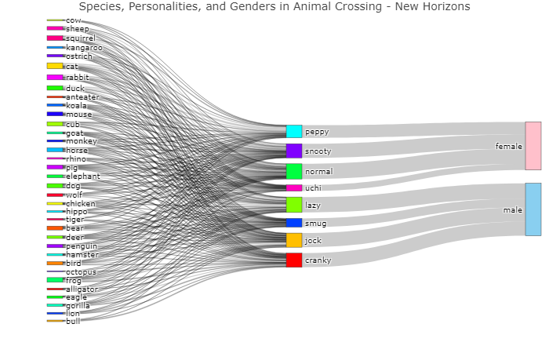

# Introduction

During the quarantine, Animal Crossing's popularity has skyrocketed - roughly [11 million people](https://www.theguardian.com/games/2020/may/13/animal-crossing-new-horizons-nintendo-game-coronavirus) are playing this life simulation game. Using data from [VillagerDB](https://github.com/jefflomacy/villagerdb), I created a Sankey diagram to show the flow of characters in regards to their species, personality, and gender. I've always wanted to create Sankey diagrams, but I didn't know it was so easy to do in R!

# R Program

## Set up

```{r setup, message=FALSE}
# source utilities
source("../utilities.R")

# packages
library(tidyverse)
library(plotly)

# set data path
data_path <- set_data_path()

# create plot folder if doesn't exist
if (!dir.exists("./plot")) {dir.create("./plot")}
```


## Load Data

```{r load data, message=FALSE}
villagers_data <- read_csv(paste0(data_path, "villagers.csv"))
```


## Manipulate data

Here, we manipulate the given data to make it easier to create a Sankey diagram. We need to create the labels and colors for nodes, as well as indicate the source, target, and value for each link between nodes.

```{r manipulate data}
# variables to analyze
villagers <- villagers_data %>% 
    select(species, personality, gender)

# list of labels for Sankey diagram for each node
villagers_label <- c(sort(unique(villagers$species)), sort(unique(villagers$personality)), sort(unique(villagers$gender)))

# list of colors for Sankey diagram for each node
villagers_color <- c(rainbow(length(unique(villagers$species))), rainbow(length(unique(villagers$personality))), "#FFC0CB", "#89cff0")

# linkage for species-personality
villagers_species_personality_link <- villagers %>%
    group_by(species, personality) %>%
    summarise(value=n()) %>%
    mutate(source=match(species, villagers_label), target=match(personality, villagers_label))

# linkage for personality-gender
villagers_personality_gender_link <- villagers %>%
    group_by(personality, gender) %>%
    summarise(value=n()) %>%
    mutate(source=match(personality, villagers_label), target=match(gender, villagers_label))

# concatenate linkages
villagers_link <- rbind(villagers_species_personality_link, villagers_personality_gender_link)

```


## Plot Data

```{r plot data, fig.width=7, fig.height=5, fig.show='hide'}
p <- plot_ly(
    type = "sankey",
    orientation = "h",

    node = list(
        label = villagers_label, 
        color = villagers_color
    ),

    link = list(
        source = villagers_link$source-1,
        target = villagers_link$target-1,
        value =  villagers_link$value
    )) %>% 
  layout(
    title = "Species, Personalities, and Genders in Animal Crossing - New Horizons",
    font = list(size = 10)
    )

#p
```

I was able to see the interactive Sankey diagram within RStudio, but rendering it to either a .md or .html file caused me problems, so I have just saved it to a .png and displayed it below. If anybody knows how to solve this solution, please reach out!



Interestingly, the personality types are unique to gender in ACNH!


## Session Info

```{r session info}
sessionInfo()
```
